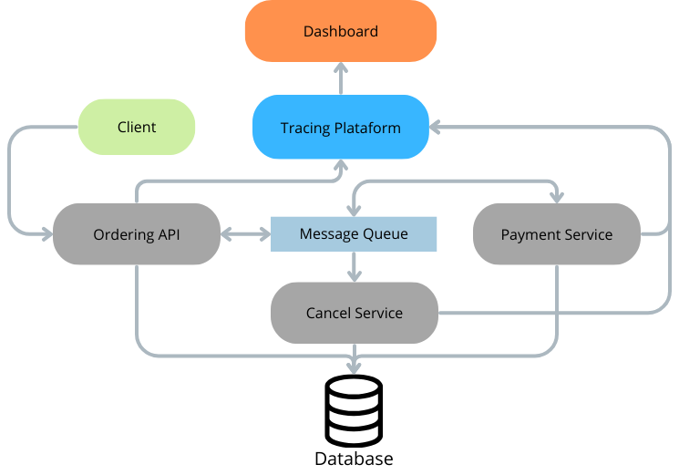

# eShop - OpenTelemetry Integration

## Introduction
This project extends **eShop**, an e-commerce system based on **ASP.NET Core and microservices**, by adding **OpenTelemetry for tracing** and **Grafana for metrics visualization**.

## Choosen Feature
The selected feature is the Order Processing flow, which establishes the process where the user, after selecting the product, enters their details and places the order. This also includes the Paid Order Status and Cancel Order services. The Paid Order Status is responsible for assigning the paid status to the order, and the Cancel Order service is responsible for canceling the order.

### Why was this feature chosen?
The feature was suggested by the project requirements, but it was also chosen because it handles personal data and is a feature that needs to obtain logs of errors and malfunctions.

### Flow
```markdown
1. Order Creation
2. Save on Database
3. Set Paid Order Status or Cancel Order (if Payment Fails)
```


### Technologies Used:
- **OpenTelemetry** for instrumentation and tracing
- **Jaeger** to visualize the traces
- **Grafana** for monitoring and metrics
- **Docker & Docker Compose** to facilitate execution
- **.NET 9 SDK** for development and execution

## How to Configure and Run

### Prerequisites
Make sure you have installed:
- [.NET 9 SDK](https://dotnet.microsoft.com/download/dotnet/9.0)
- [Docker and Docker Compose](https://docs.docker.com/get-docker/)

### Clone the repository and start the services
```bash
# Clone the project (SSH)
git clone git@github.com:lilikas11/eShop-AS.git
cd eShop-AS

# Start all services via Docker Compose
docker-compose up -d

# Run the application
dotnet run --project src/eShop.AppHost/eShop.AppHost.csproj
```

## How to view traces in Jaeger
The **Jaeger UI** can be accessed at:
```
http://localhost:16686
```

### Steps to view traces:
1. Access the Jaeger UI.
2. In the **Service** dropdown, select `Ordering.API`.
3. Click "Find Traces" to view the traced requests.

## How to view metrics in Grafana
The **Grafana UI** can be accessed at:
```
http://localhost:3000
```

### Steps to configure Grafana:
1. Access Grafana and log in.
2. Go to "Data Sources" and add **Jaeger** as a data source.
3. Import the **dashboard.json** to view the metrics.

### Test
You can test different metrics by accessing the application's web page:
```
http://localhost:7298/
```

## How does it work?

### Jaeger
First, in the Program.cs file of the code we define OpenTelemetry service

```csharp
builder.Services.AddOpenTelemetry()
    .WithTracing(tracerProviderBuilder =>
    {
        tracerProviderBuilder
            .SetResourceBuilder(ResourceBuilder.CreateDefault().AddService("Ordering.API"))
            .AddAspNetCoreInstrumentation()
            .AddHttpClientInstrumentation()
            .AddSqlClientInstrumentation()
            .AddSource("Ordering.API")
            .AddOtlpExporter(opts =>
            {
                opts.Endpoint = new Uri("http://localhost:4317");
            });
    });
```

For the ordering feature, an activity was added in the Create Order process to signal the tracing source. This trace acts as a log containing various metrics and execution time. If the database fails to save the order, the error will also be recorded in Jaeger.

Additionally, tracing logs were implemented in the SetPaidOrderStatus and CancelOrderCommand, capturing the execution time and Order ID.

```csharp
    public async Task<bool> Handle(CreateOrderCommand message, CancellationToken cancellationToken)
    {
        using var activity = ActivitySource.StartActivity("CQRS - Handle CreateOrderCommand");

        activity?.SetTag("user.id", message.UserId);
        activity?.SetTag("user.name", message.UserName);

        activity?.SetTag("order.total_items", message.OrderItems?.Count() ?? 0);
        activity?.SetTag("order.total_value", (message.OrderItems?.Sum(i => i.UnitPrice * i.Units) ?? 0).ToString("F2"));

        activity?.SetTag("order.payment.method", message.CardTypeId);
        activity?.SetTag("order.card_number", MaskCardNumber(message.CardNumber)); 

        activity?.SetTag("order.shipping.city", message.City);
        activity?.SetTag("order.shipping.country", message.Country);
        activity?.SetTag("order.shipping.state", message.State);
        activity?.SetTag("order.shipping.zipcode", message.ZipCode);


        _logger.LogInformation("Processing new order - Order: {@Order}", message);

        // Add Integration event to clean the basket
        var orderStartedIntegrationEvent = new OrderStartedIntegrationEvent(message.UserId);
        await _orderingIntegrationEventService.AddAndSaveEventAsync(orderStartedIntegrationEvent);

        var address = new Address(message.Street, message.City, message.State, message.Country, message.ZipCode);
        var order = new Order(message.UserId, message.UserName, address, message.CardTypeId, message.CardNumber, message.CardSecurityNumber, message.CardHolderName, message.CardExpiration);

        foreach (var item in message.OrderItems)
        {
            order.AddOrderItem(item.ProductId, item.ProductName, item.UnitPrice, item.Discount, item.PictureUrl, item.Units);
        }

        _logger.LogInformation("Creating Order - Order: {@Order}", order);

        _orderRepository.Add(order);

        var result = await _orderRepository.UnitOfWork.SaveEntitiesAsync(cancellationToken);

        if (!result)
        {
            activity?.SetStatus(ActivityStatusCode.Error);
            activity?.SetTag("error", true);
            activity?.SetTag("error.message", "Failed to save order in the database");
            _logger.LogError("Failed to save order in the database for user {UserId}", message.UserId);        
        }
        else
        {
            activity?.SetStatus(ActivityStatusCode.Ok);
            activity?.SetTag("error", false);
            _logger.LogInformation("Order successfully created for user {UserId}", message.UserId);

        }


        return result;
    }
```

### Grafana
To add the grafana dashboard the right docker-compose configuration was done and the dashboards were define.


### Security and Sensitive Data Protection
- Logs and traces mask sensitive information (credit cards).

```csharp
 activity?.SetTag("order.card_number", MaskCardNumber(message.CardNumber)); 
 ```

## Screenshots


## Architecture



## Conclusion
- OpenTelemetry was successfully integrated for request tracing.
- Jaeger and Grafana were configured for **metrics monitoring and request analysis**.
- We implemented **security to mask sensitive data** and ensure compliance.
