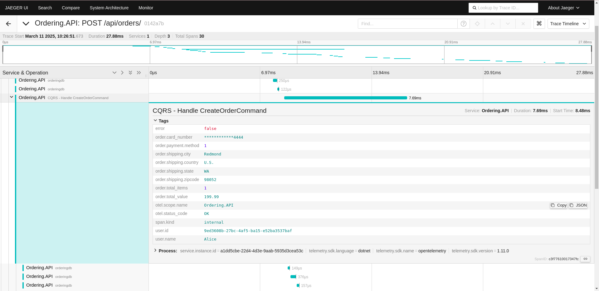
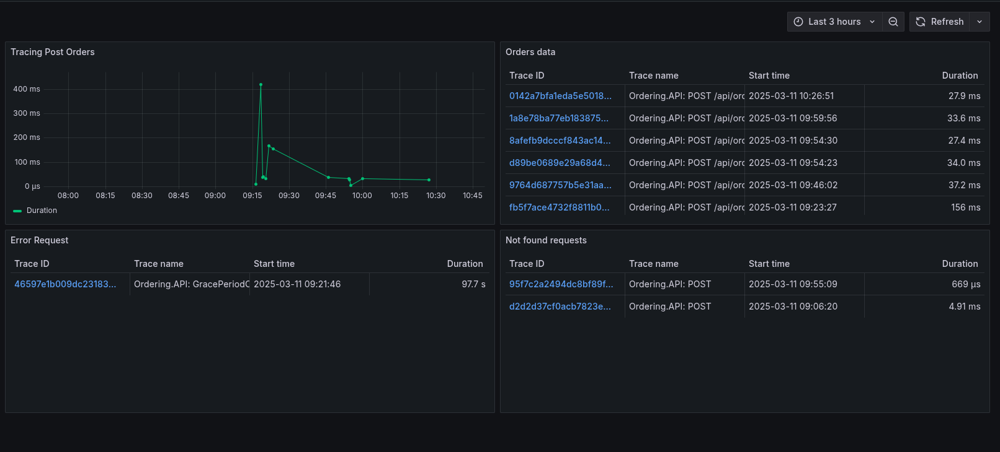

# eShop - OpenTelemetry Integration

## Introduction
This project extends **eShop**, an e-commerce system based on **ASP.NET Core and microservices**, by adding **OpenTelemetry for tracing** and **Grafana for metrics visualization**.

### Technologies Used:
- **OpenTelemetry** for instrumentation and tracing
- **Jaeger** to visualize the traces
- **Grafana** for monitoring and metrics
- **Docker & Docker Compose** to facilitate execution
- **.NET 9 SDK** for development and execution

## How to Configure and Run

### Prerequisites
Make sure you have installed:
- [.NET 9 SDK](https://dotnet.microsoft.com/download/dotnet/9.0)
- [Docker and Docker Compose](https://docs.docker.com/get-docker/)

### Clone the repository and start the services
```bash
# Clone the project (SSH)
git clone git@github.com:lilikas11/eShop-AS.git
cd eShop-AS

# Start all services via Docker Compose
docker-compose up -d

# Run the application
dotnet run --project src/eShop.AppHost/eShop.AppHost.csproj
```

## How to view traces in Jaeger
The **Jaeger UI** can be accessed at:
```
http://localhost:16686
```

### Steps to view traces:
1. Access the Jaeger UI.
2. In the **Service** dropdown, select `Ordering.API`.
3. Click "Find Traces" to view the traced requests.

## How to view metrics in Grafana
The **Grafana UI** can be accessed at:
```
http://localhost:3000
```

### Steps to configure Grafana:
1. Access Grafana and log in.
2. Go to "Data Sources" and add **Jaeger** as a data source.
3. Import the **dashboard.json** to view the metrics.

### Test
You can test different metrics by accessing the application's web page:
```
http://localhost:7298/
```

## Security and Sensitive Data Protection
- Logs and traces mask sensitive information (credit cards).

## Screenshots



## Conclusion
- OpenTelemetry was successfully integrated for request tracing.
- Jaeger and Grafana were configured for **metrics monitoring and request analysis**.
- We implemented **security to mask sensitive data** and ensure compliance.
